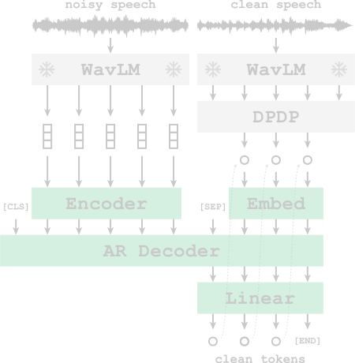

# Denoising Tokenizer for Speech



## This is a Work in Progress!

- [x] Get a simple model working on offline features and targets
- [x] Add DPDP to compute target from features on the fly
- [ ] Add online feature extraction
- [ ] Add dataset where different types and levels of noise are added to the waveform

## Installation

### Install pipx

For more information see https://pipx.pypa.io/stable/installation/

```bash
sudo apt update
sudo apt install pipx
pipx ensurepath
```

### Install poetry

For more information see https://python-poetry.org/docs/
```bash
pipx install poetry
```

### Install dependencies in a new environment

```bash
poetry shell
poetry install --no-root
```

### Instal k2

This requires some manual installation.

#### Option 1

Follow the instructions in https://k2-fsa.github.io/k2/installation/from_wheels.html and figure it out.

**Important!!!!** Install the CPU version. No need for the CUDA version. We use k2 in the dataloader and not during training.

#### Option 2 (TLDR;)

Check python and torch version:

```bash
python --version
python -c "import torch; print(torch.__version__)"
```

For example
```
Python 3.10.12
2.3.0+cu121
```

**Important!!!!** Go look up the appropriate wheel file to install from https://k2-fsa.github.io/k2/cpu.html/.

I used Ctrl-F and searched for torch2.3.0-cp310 and selected the linux version. For me the link was:

```
https://huggingface.co/csukuangfj/k2/resolve/main/cpu/k2-1.24.4.dev20240425+cpu.torch2.3.0-cp310-cp310-manylinux_2_17_x86_64.manylinux2014_x86_64.whl
```

Download and install the wheel:
```bash
wget https://huggingface.co/csukuangfj/k2/resolve/main/cpu/k2-1.24.4.dev20240425+cpu.torch2.3.0-cp310-cp310-manylinux_2_17_x86_64.manylinux2014_x86_64.whl
pip install ./k2-1.24.4.dev20240425+cpu.torch2.3.0-cp310-cp310-manylinux_2_17_x86_64.manylinux2014_x86_64.whl
```

## Usage

Instructions coming soon...

## Training

Instructions coming soon...

# References

Papers:
- This [paper](https://arxiv.org/abs/2409.02565) for some ideas around the denoising auto-encoder.
- This [paper](https://arxiv.org/abs/2306.00697) for their approach to adding noise.

Repos:
- This [Mistral repo](https://github.com/mistralai/mistral-inference) for their transformer model.

Datasets:
- The [LibriSpeech](https://www.openslr.org/12) dataset
- The [DEMAND](https://www.kaggle.com/datasets/chrisfilo/demand) dataset.